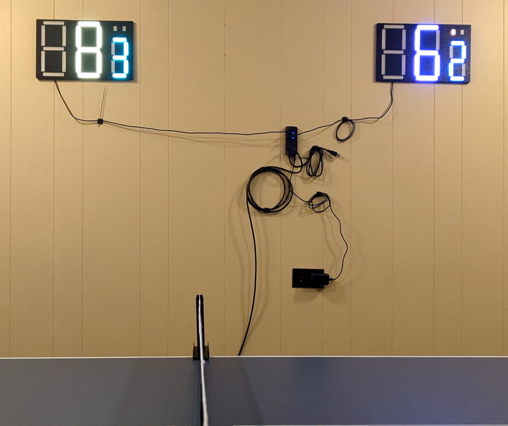

# TableTally


TableTally is a comprehensive scoreboard system for managing ping pong (table tennis) matches. It tracks scores for individual games, overall matches, and serve indications, ensuring all the rules are followed automatically. With TableTally, you can focus on your game while it handles the rest!

## On Youtube
[](https://www.youtube.com/watch?v=OYS0w0hd2Nw)

## Features

- **Game and Match Scorekeeping**: Updates and tracks player scores across games and matches.
- **Serve Indication**: Keeps track of whose serve it is, with automatic alternation based on standard ping pong rules.
- **Match Management**: Supports tracking multiple games in a match and determining the winner in a best of 7.
- **User-friendly Interface**: Intuitive to use during fast-paced matches with just simple button presses.

## Installation

1. Clone this repository:
   ```bash
   git clone https://github.com/MapleLeafMakers/TableTally.git
   cd tabletally
   ```

2. Copy to PICO's using Thonny or application of your choice ensuring all files are in the root of the pico.

## Configuration

- All settings for each scoreboard and the controller are contained in their own settings.py files.   You can update network names, colours and the other configurables here.

## Usage

- Power up all the pico's and then press both buttons to indicate a match is starting.
- Press a single button again to indicate who is serving first.
- After each point, the scoring player hits the button to update the boards and game state.
- Holding both buttons for 5 seconds will restart the match.

## Contributing

Contributions are welcome! Feel free to open an issue or submit a pull request to improve TableTally.

## License

This project is licensed under the MIT License. See the [LICENSE](LICENSE) file for details.

---

## Future Plans
- Integrate live score updates for remote viewers on our TableTennis stat tracking system.
- Create a single pico version that doesn't rely on wireless connectivity.
